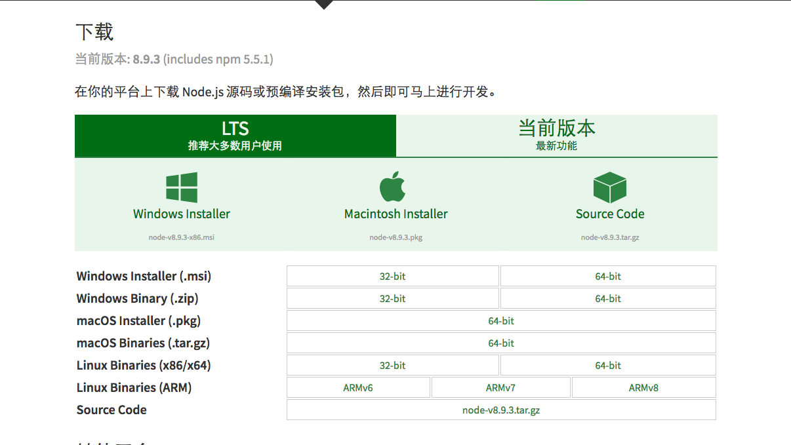
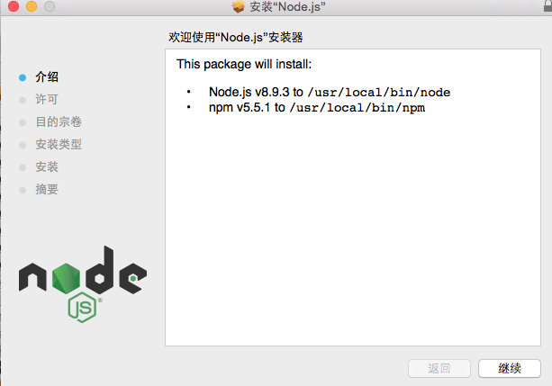
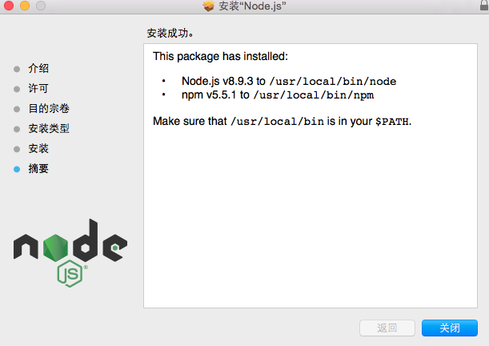
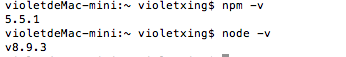
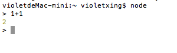
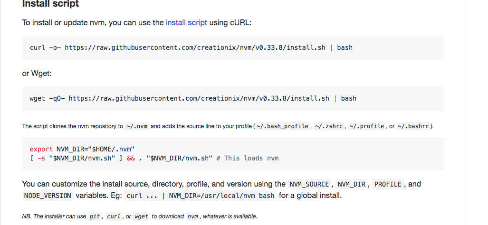
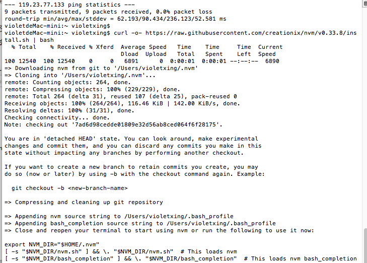
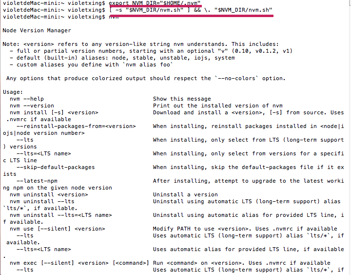

# 用虚拟机安装node.js

## 1.下载node的镜像

官网地址:[https://nodejs.org/en/download/current/](https://nodejs.org/en/download/current/)



## 2、安装node





## 3、检查版本号

npm版本号：`npm -v`

node版本号：`node -v`



## 4.使用node



## 5、安装nvm

打开网址：[https://github.com/creationix/nvm](https://github.com/creationix/nvm)

点击**install script**



把其中
```
curl -o- https://raw.githubusercontent.com/creationix/nvm/v0.33.8/install.sh | bash
```
复制下了来，在终端里运行，就可以安装nvm了。但是还不能用，所以接下来配置环境变量。



然后把下面的两行代码复制了

```
export NVM_DIR="$HOME/.nvm"
[ -s "$NVM_DIR/nvm.sh" ] && \. "$NVM_DIR/nvm.sh"  # This loads nvm
```

然后输入 `nvm`



出现这样的界面就是证明nvm安装成功了。


